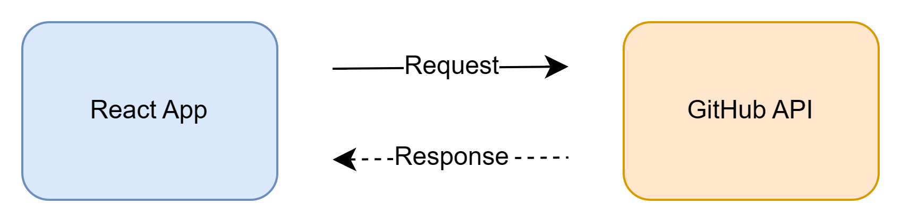
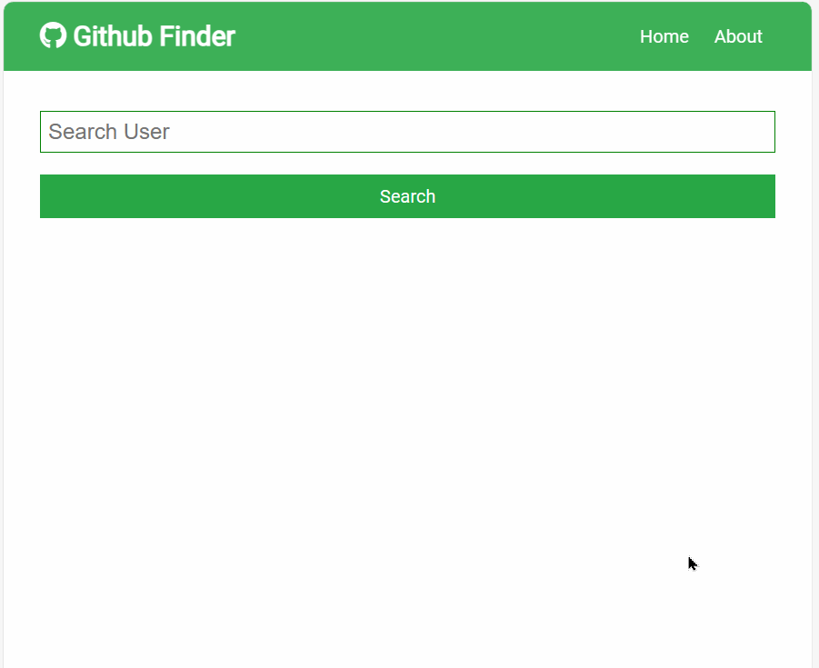
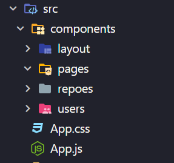
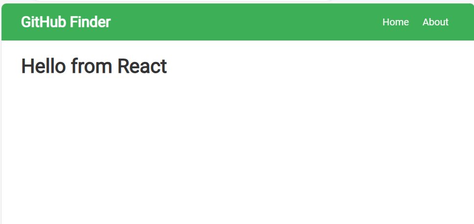
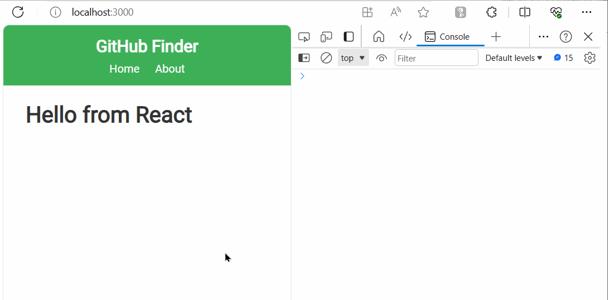
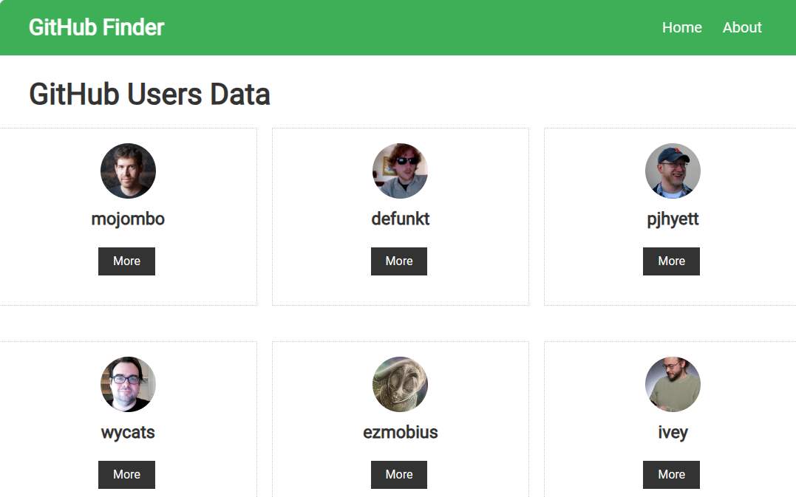
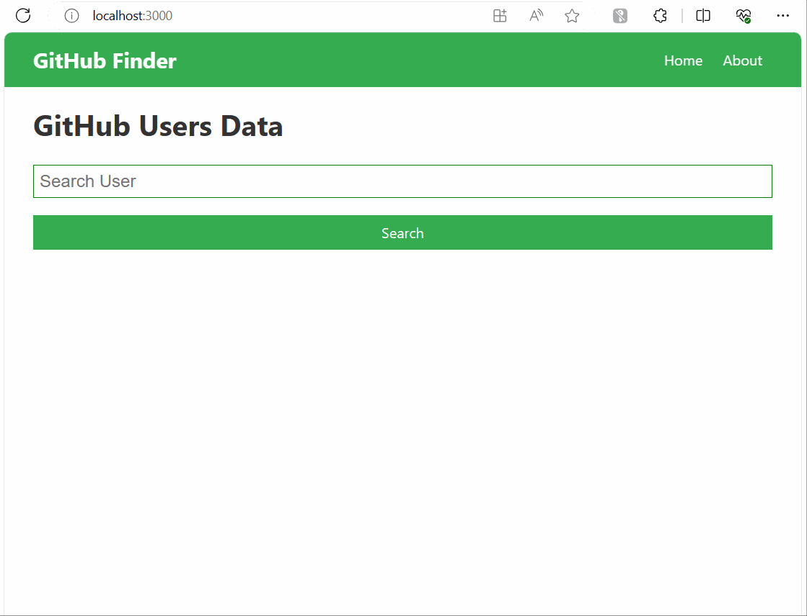
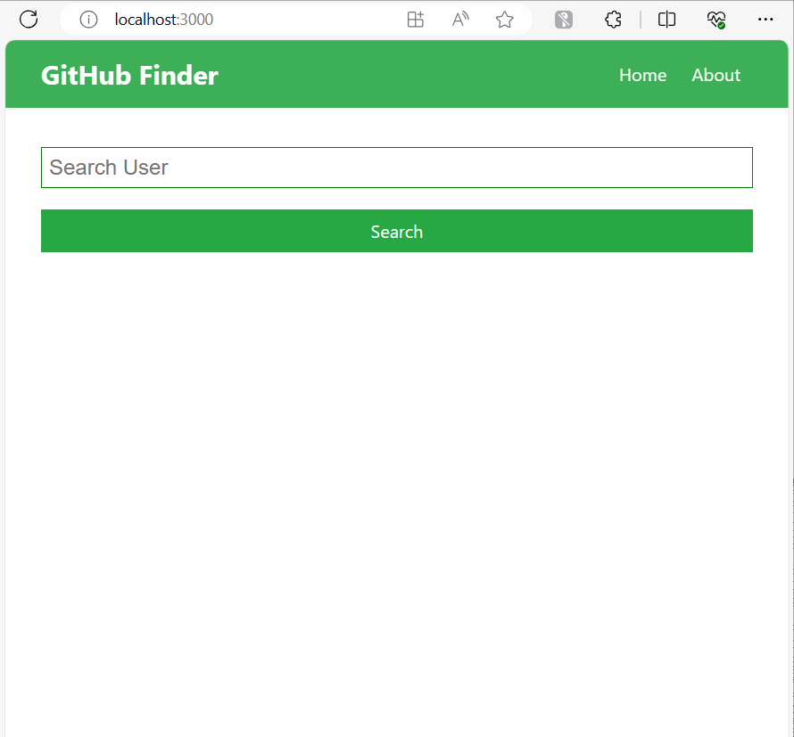
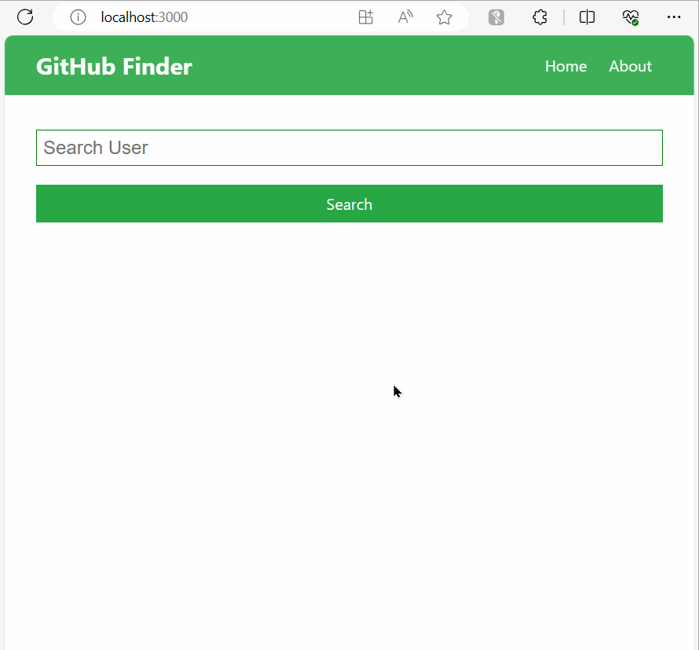

# Guided Project: Github Finder

## What does it do?

It searches for all the Github users using the text inputted by the user in the form. It returns all the users matching the string in a grid format. Clicking on the `more` tab takes the user to a custom made page with the vital stats.

## Archiecture Overall



In this project, we will create a React App and use GitHub API to search information then display it



We will use following endpoints from GitHub API to make requests

```bash
GET https://api.github.com/users/                 # Get list of Users
GET https://api.github.com/users/:username        # Get user information by name
GET https://api.github.com/users/:username/repos  # Get repos information by name
GET https://api.github.com/search/users?q=search  # Search users
```

## Setup CSS

To speed up the development time, we use the provided `App.css` on the file `/src/App.css`.

This will contains all needed styling

## Setup Folder Structure

Now, folder structure is very crucial. You will setup the folder structure like this.



## Create Navbar Component

Now, it's time to create our first component. We will create the `Navbar` component then place it on `src/components/layout`

```js
// /src/components/layout/Navbar.js
import React from "react";

const Navbar = () => {
  return (
    <nav className="navbar bg-success">
      <h1>
        <i className="fab fa-github" /> GitHub Finder
      </h1>
      <ul>
        <li>
          <a href="#>">Home</a>
          <a href="#>">About</a>
        </li>
      </ul>
    </nav>
  );
};

export default Navbar;
```

Then, update the `App.js` to display the Navbar

```js
import "./App.css";
import Navbar from "./components/layout/Navbar";

function App() {
  return (
    <div className="App">
      <Navbar />
      <div className="container">
        <h1>Hello from React</h1>
      </div>
    </div>
  );
}

export default App;
```

This is the result


## Use `useEffect` to fetch data with `axios`

To fetch data, we will use `axios` to make request.

Use the following command to install it

```bash
npm install axios
```

Great. We will update the `App.js` file to fetch the data then display on the console first.

```js
import axios from "axios";
import { useEffect } from "react";
import "./App.css";
import Navbar from "./components/layout/Navbar";

function App() {
  // Use the 'useEffect' hook to perform side effects in function components
  useEffect(() => {
    // Define an asynchronous function 'fetchData' to fetch data from the GitHub API
    const fetchData = async () => {
      try {
        // Use the 'axios' library to make a GET request to the GitHub API endpoint
        const response = await axios.get("https://api.github.com/users");

        // Log the fetched data to the console
        console.log("GitHub Users:", response.data);
      } catch (error) {
        // Log an error message if there's an issue fetching data
        console.error("Error fetching data:", error);
      }
    };

    // Call the 'fetchData' function when the component mounts
    fetchData();
  }, []); // The empty dependency array ensures that 'useEffect' runs only once when the component mounts
  return (
    <div className="App">
      <Navbar />
      <div className="container">
        <h1>Hello from React</h1>
      </div>
    </div>
  );
}

export default App;
```

Now, we you reload the app, you can see the data being fetch



You may wonder why there is 2 response. It's because of StrictMode. Just remove it on `index.js` to correct the behavior.

```js
// index.js
const root = ReactDOM.createRoot(document.getElementById('root'));
root.render(
  <React.StrictMode>    # Remove this line
    <App />
  </React.StrictMode>   # Remove this line
);
```

## Create `Users` and `UserItem` component to display all information

Now, we will create `Users` and `UserItem` to display all data.

First, we will create the `UserItem` first.

```js
// /src/components/users/UserItem.js
import React from "react";

const UserItem = (props) => {
  const { login, avatar_url, html_url } = props.user;

  return (
    <div className="card text-center">
      
      <h3>{login}</h3>
      <div>
        <a href="#" className="btn btn-dark btn-sm my-1">
          More
        </a>
      </div>
    </div>
  );
};

export default UserItem;
```

Then, create `Users` components.

```js
// Users.js
import React from "react";
import UserItem from "./UserItem";

const Users = (props) => {
  const { users } = props;
  return (
    <div style={userStyle}>
      {users.map((user) => (
        <UserItem key={user.id} user={user} />
      ))}
    </div>
  );
};

const userStyle = {
  display: "grid",
  gridTemplateColumns: "repeat(3,1fr)",
  gridGap: "1rem",
};

export default Users;
```

Now, we will update the `App.js` file to user `Users` component

```js
// App.js
const App = () => {
  const [users, setUsers] = useState([]);

  useEffect(() => {
    const fetchData = async () => {
      try {
        const response = await axios.get("https://api.github.com/users");
        setUsers(response.data);
      } catch (error) {
        console.error("Error fetching data:", error);
      }
    };

    fetchData();
  }, []);

  return (
    <div className="App">
      <Navbar />
      <div className="container">
        <h1>GitHub Users Data</h1>
      </div>
      <Users users={users} />
    </div>
  );
};

export default App;
```

Reload the app to see the result


By doing the previous guided, you know how to

- Make API request with `axios` then handle the response
- Use `useEffect` and see the react life cycle

## Create Search Component

Now, we will create the Search component to handle the input then fetch the api.

Steps will be:

1. User will input to `Search` component then submit
2. Fetch the data
3. Display the response with `Users` component

### Create the `Search` component

You will create it on `/src/components/users`

```js
// Search.js
import axios from "axios";
import React, { useState } from "react";
import Users from "./Users";

const Search = () => {
  const [text, setText] = useState("");
  const [users, setUsers] = useState([]);

  const searchUsers = async (text) => {
    try {
      const response = await axios.get(
        `https://api.github.com/search/users?q=${text} `
      );
      setUsers(response.data.items);
    } catch (error) {
      console.error("Error fetching data:", error);
    }
  };

  const onSubmit = (e) => {
    e.preventDefault();
    if (text === "") {
      alert("Please enter something");
    } else {
      searchUsers(text);
      setText("");
    }
  };

  const onChange = (e) => setText(e.target.value);

  return (
    <div>
      <form onSubmit={onSubmit} className="form">
        <input
          type="text"
          name="text"
          placeholder="Search User"
          value={text}
          onChange={onChange}
        />
        <input
          type="submit"
          value="Search"
          className="btn btn-success btn-block"
        />
      </form>
      <Users users={users} />
    </div>
  );
};

export default Search;
```

After that, update the `App.js` to use the `Search`

```js
// App.js
import React from "react";
import "./App.css";
import Navbar from "./components/layout/Navbar";
import Search from "./components/users/Search";

const App = () => {
  return (
    <div className="App">
      <Navbar />
      <div className="container">
        <h1>GitHub Users Data</h1>
        <Search />
      </div>
    </div>
  );
};

export default App;
```

You can see the application now has a search input then it will display the search result for us.



Now, we will add a Clear button to clear all search results

```js
// Search.js
import axios from "axios";
import React, { useState } from "react";
import Users from "./Users";

const Search = () => {
  const [text, setText] = useState("");
  const [users, setUsers] = useState([]);

  const searchUsers = async (text) => {
    // .. Rest of the code
  };

  const clearUsers = () => {
    setUsers([]);
  };

  const onSubmit = (e) => {
    // ... rest of the code
  };

  const onChange = (e) => setText(e.target.value);

  return (
    <div>
      <form onSubmit={onSubmit} className="form">
        {/*<!..> ... The rest of the form */}
      </form>
      {/*Adding Clear button */}
      {users.length > 0 && (
        <button className="btn btn-danger btn-block" onClick={clearUsers}>
          Clear
        </button>
      )}
      <Users users={users} />
    </div>
  );
};

export default Search;
```


## Setup React Router

Now, it's time to setup the React Router. To make it simple, we will use version 5.2.0

```bash
npm install react-router-dom@5.2.0
```

After that, we will update the `App.js` to use the Router

```js
import React from "react";
import { Route, BrowserRouter as Router, Switch } from "react-router-dom";
import "./App.css";
import Navbar from "./components/layout/Navbar";
import Search from "./components/users/Search";

const App = () => {
  return (
    <div className="App">
      <Router>
        <Navbar />
        <div className="container">
          <h1>GitHub Users Data</h1>
          <Switch>
            <Route exact path="/" component={Search} />
          </Switch>
        </div>
      </Router>
    </div>
  );
};

export default App;
```

## Create `About` and `NotFound` components

We will create the `About` to have the basic information of the project. The `NotFound` component is used to handle undefined route

```js
// About.js
import React from "react";

const About = () => {
  return (
    <div className="all-center">
      <div className="textclass">
        <h1 className="x-large text-primary">Github Finder App</h1>
        <p className="lead">
          This is a simple web application for finding Github users and their
          repositories.
        </p>
      </div>
    </div>
  );
};

export default About;
```

```js
// NotFound.js
import React from "react";

const NotFound = () => {
  return (
    <div className="all-center">
      <h1 className="x-large text-danger">404 - Page Not Found</h1>
      <p className="lead">
        Sorry, the page you are looking for does not exist.
      </p>
    </div>
  );
};

export default NotFound;
```

Then, we have to update the `Navbar.js` a bit to use the `Link` component of the Router.

```js
import React from "react";
import { Link } from "react-router-dom";

const Navbar = () => {
  return (
    <nav className="navbar bg-success">
      <h1>
        <i className="fab fa-github" /> GitHub Finder
      </h1>
      <ul>
        <li>
          <Link to="/">Home</Link>
          <Link to="/about">About</Link>
        </li>
      </ul>
    </nav>
  );
};

export default Navbar;
```

After that, update the `App.js` to use the `About` and `NotFound` components

```js
// App.js
const App = () => {
  return (
    <div className="App">
      <Router>
        <Navbar />
        <div className="container">
          <Switch>
            <Route exact path="/" component={Search} />
            <Route exact path="/about" component={About} />
            <Route path="/*" component={NotFound}></Route>
          </Switch>
        </div>
      </Router>
    </div>
  );
};

export default App;
```

Now, the application has multiple pages



## Create `User` component to display all information to user

After we search the user, we want to see all information of selected one.

Now, we will create the `User` component to (1) fetch the data then (2) display all of it.

First, we have to update the `App.js` file first to specify the routing

```js
// App.js
const App = () => {
  return (
    <div className="App">
      <Router>
        <Navbar />
        <div className="container">
          <Switch>
            <Route exact path="/" component={Search} />
            <Route exact path="/about" component={About} />
            {/* Add this line to specify the routing*/}
            <Route exact path="/user/:id" component={User} />
            <Route path="/*" component={NotFound}></Route>
          </Switch>
        </div>
      </Router>
    </div>
  );
};
```

Then, we have to update the `UserItem` a bit to use the `Link`

```js
// UserItem.js
import React from "react";
import { Link } from "react-router-dom/cjs/react-router-dom.min";

const UserItem = (props) => {
  const { login, avatar_url, html_url } = props.user;

  return (
    <div className="card text-center">
      
      <h3>{login}</h3>
      <div>
        <Link to={`/user/${login}`} className="btn btn-dark btn-sm my-1">
          More
        </Link>
      </div>
    </div>
  );
};

export default UserItem;
```

Now, we can create the `User` component

```js
// User.js
import axios from "axios";
import React, { Fragment, useEffect, useState } from "react";
import { Link, useParams } from "react-router-dom/cjs/react-router-dom.min";

const User = () => {
  const { id } = useParams();
  const [user, setUser] = useState({});

  const getUser = async (username) => {
    try {
      const response = await axios.get(
        `https://api.github.com/users/${username}`
      );
      const data = response.data;
      setUser(data);
    } catch (error) {
      console.error("Error fetching data:", error.message);
    }
  };

  useEffect(() => {
    getUser(id);
  }, []);

  const {
    name,
    avatar_url,
    location,
    bio,
    company,
    blog,
    login,
    html_url,
    followers,
    following,
    public_repos,
    public_gists,
    hireable,
  } = user;

  return (
    <Fragment>
      <Link to="/" className="btn btn-light">
        Back to Search
      </Link>
      Hireable: {hireable ? (
        <i className="fas fa-check text-success" />
      ) : (
        <i className="fas fa-times-circle text-danger" />
      )}
      <div className="card grid-2">
        <div className="all-center">
          
          <h1>{name}</h1>
          <p>{location}</p>
        </div>
        <div>
          {bio && (
            <Fragment>
              <h3>Bio:</h3>
              <p>{bio}</p>
            </Fragment>
          )}
          <a
            href={html_url}
            className="btn btn-dark my-1"
            target="_blank"
            rel="noopener noreferrer"
          >
            Show Github Profile
          </a>
          <ul>
            <li>
              {login && (
                <Fragment>
                  <strong>Username: </strong>
                  {login}
                </Fragment>
              )}
            </li>
            <li>
              {company && (
                <Fragment>
                  <strong>Company: </strong>
                  {company}
                </Fragment>
              )}
            </li>
            <li>
              {blog && (
                <Fragment>
                  <strong>Website: </strong>
                  <a href={blog} target="_blank" rel="noopener noreferrer">
                    {blog}
                  </a>
                </Fragment>
              )}
            </li>
          </ul>
        </div>
      </div>
      <div className="card text-center">
        <div className="badge badge-primary">Followers: {followers}</div>
        <div className="badge badge-success">Following: {following}</div>
        <div className="badge badge-light">Repository: {public_repos}</div>
        <div className="badge badge-dark">Gist: {public_gists}</div>
      </div>
    </Fragment>
  );
};

export default User;
```

Now, we can see the details information of the user



## Create `Repos` and `RepoItem` components

## Refactor: Add `Api.js` to handle all API call

## Refactor: Create `Home` component

## Deploy on Netlify
